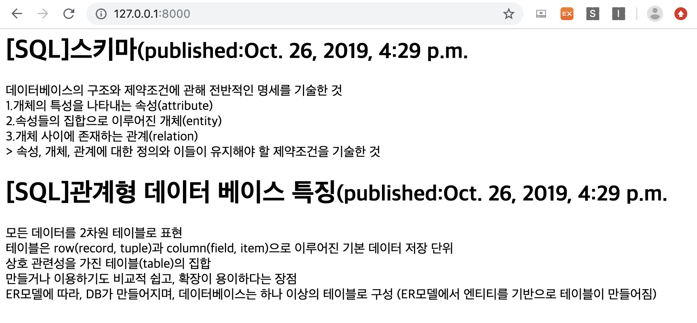

# Django 

## (1) Django 설치하기

1. python version 확인
```
python --version
```

2. python의 가상환경(Virtual Environment)을 간단하게 사용할 수 있는 virtualenv 모듈 설치
```
pip install virtualenv pylint autopep8
```

3. Django를 사용하기 위한 환경 셋팅
```
mkdir server
cd server
virtualenv venv
```
위의 코드를 실행했을 때 아래와 같은 글이 나오면 성공
**Installing setuptools, pip, wheel...
done.**

4. 가상환경 활성화
```
source venv/bin/activate
```

5. Django 설치
```
pip install django
```

5. +) 잘 설치되었는지 확인
```
django-admin --version
```

6. 설치된 개발환경 파일로 저장
```
pip freeze > requirements.txt
```

7. 설치가 완료되면 가상환경 종료
```
deactivate
```


## (2) Django 셋팅

1. 프로젝트 생성
```
django-admin startproject django_project
```

2. Django 구조 
(생성한 프로젝트는 django_project의 하위 파일)
    * settings.py : 전반적인 장고의 설정을 가지고 있는 파일
    * urls.py : 프로젝트의 url을 관리하는 파일
    * wsgi.py : 웹서버와 연동하기 위한 파일
    * manage.py : 프로젝트 관리 (DB의 migration 생성 및 실행, 로컬에서 웹서버 가동 등)

3. `settings.py` 파일 수정 (108, 114 line)
```
TIME_ZONE = 'Asia/Seoul'
USE_TZ = False
```

4. static 파일을 다루기 위해 `STATIC_ROOT` 파일 추가
```
STATIC_URL = '/static/'
STATIC_ROOT = os.path.join(BASE_DIR, 'static')
```

5. Django 테스트 웹서버 실행
```
python manage.py runserver
```

## (3) Django 어플리케이션 생성

1. 경로 (cd django_project인 상태에서)
```
python manage.py startapp blog
```

2. 어플리케이션 등록
- 장고 어플리케이션을 생성하였으니, 장고 프로젝트에 새로 생성한 어플리케이션을 등록해야한다.
- 장고 프로젝트를 관리하는 `django_project/settings.py`를 열고 어플리케이션 등록
```
INSTALLED_APPS = [
.
.
.
'blog'
]
```
제일 밑에 새로 만든 어플리케이션인 blog를 추가해준다.


## (4) 모델(Model) 생성
- `blog/models.py`를 열고 아래의 내용을 추가

```python
from django.db import models
from django.utils import timezone

class Post(models.Model):
    author = models.ForeignKey('auth.User', on_delete=models.CASCADE)
    title = models.CharField(max_length=100)
    content = models.TextField()
    created_at = models.DateTimeField(auto_now_add=True)
    updated_at = models.DateTimeField(auto_now=True)
    published_at = models.DateTimeField(blank = True, null = True)

    def publish(self):
        self.published_at = timezone.now()
        self.save()

    def __str__(self):
        return self.title
```
- 블로그를 목적으로 모델을 구성할 때 기본이 되는 코드 
- 기본적으로 Post는 블로그 게시글의 모델을 정의하는 클래스
    - author, title, content, created_at, updated_at,  published_at 필드를 가진다.
* Field types - 각각의 필드는 적절한 필드 클래스의 인스턴스여야 한다.
    - 필드 클래스는 아래의 몇 가지 사항을 정의합니다.
        1. 데이터베이스 컬럼의 데이터 형
        2. form field를 렌더링 할 때 사용할 기본 HTML 위젯
        3. Django admin에서 자동으로 만들어지는 form의 검증 형태
- publish :  현재 시간을 받아서 날짜를 갱신
- __str__ :  표준 파이썬 클래드 메소드 -- 문자열 반환

:eyes: 더 자세한 사항은 [Django Model field reference](https://docs.djangoproject.com/en/1.10/ref/models/fields/#model-field-types) 참고!

## (5)모델(Model)과 DB
1. 모델로부터 데이터베이스 테이블을 생성하기 위한 마이그레이션 파일 생성
```
python manage.py makemigrations blog

Migrations for 'blog' :
    blog/migrations/0001_initial.py
    - Create model Post**
```
- 위와 같은 글이 출력되면 정상적으로 생성된 것

2. 모델로부터 생성한 마이그레이션 파일을 이용하여 데이터베이스 테이블 생성
```
python manage.py migrate blog

Operations to perform:
    Apply all migrations: blog
    Running migrations:
    Applying contenttypes.0001_initial... OK
    Applying auth.0001_initial... OK
    Applying blog.0001_initial... OK
```
- 위와 같은 글이 출력되면 정상적으로 테이블 생성된 것

## (6)슈퍼유저 등록
```
(venv)python manage.py createsuperuser
Username : 
Email address: 
Password: 
Password (again): 
```
절차에 맞게 입력. 
정상적으로 입력이 되면  **Superuser created successfully.** 문구가 출력된다.

## (7) 관리자 페이지 접속
```
python manage.py runserver
```
`http://127.0.0.1:8000/admin` 에 접속

- 슈퍼유저 등록시 지정했던 Username과 Password를 입력한다.


위와 같이 접속된 관리자 페이지를 볼 수 있다.

## (8) 관리자 페이지에 모델 등록
- 장고가 기본적으로 제공하는 관리자 페이지에서 우리가 만든 장고 어플리케이션 모델을 관리하기 위해서는 모델을 등록해야한다.
`blog/admin.py`을 열고 `Post`모델을 등록시킨다.
```python
from django.contrib import admin
from .models import Post

admin.site.register(Post)
```
새로고침 후 관리자 페이지를 확인하면 `blog/admin.py` 장고 어플리케이션의 모델이 화면에 표시된다. 


- **BLOG/Posts**에 옆에 있는 **+Add**를 눌러 글을 작성


- 성공적으로 글이 올라간 것을 확인할 수 있다.

## sqlite python parser
### python pandas를 활용하여 sqlite파일을 확인하고 다룰 수 있다.
* sqlite와 python을 parsing을 하면 DataFrame을 활용하여 데이터를 전처리할 수도 있고 csv로 저장 할 수 있다. :+1:

1. import 해주고 sqlite파일이 있는 경로를 찾아 connect
```python
import sqlite3
import pandas as pd
con = sqlite3.connect('db.sqlite3가 들어있는 절대경로를 적는다.')
```

2. SQL구문을 호출하려면 cursor 객체가 필요
```python
cursor = con.cursor() 
cursor.execute('SELECT * FROM blog_post')
```

3. 선택한 테이블로부터 로우 단위로 데이터를 읽으려면 fetchall 메서드 호출
```python
cursor.fetchall()


[(1,
'[SQL]관계형 데이터 베이스 특징',
'모든 데이터를 2차원 테이블로 표현\r\n테이블은 row(record, tuple)과 column(field, item)으로 이루어진 기본 데이터 저장 단위\r\n상호 관련성을 가진 테이블(table)의 집합\r\n만들거나 이용하기도 비교적 쉽고, 확장이 용이하다는 장점\r\nER모델에 따라, DB가 만들어지며, 데이터베이스는 하나 이상의 테이블로 구성 (ER모델에서 엔티티를 기반으로 테이블이 만들어짐)',
'2019-10-26 16:29:11.179508',
'2019-10-26 16:29:11.179532',
'2019-10-26 16:29:06',
1),
(2,
'[SQL]스키마',
'데이터베이스의 구조와 제약조건에 관해 전반적인 명세를 기술한 것\r\n1.개체의 특성을 나타내는 속성(attribute)\r\n2.속성들의 집합으로 이루어진 개체(entity)\r\n3.개체 사이에 존재하는 관계(relation)\r\n> 속성, 개체, 관계에 대한 정의와 이들이 유지해야 할 제약조건을 기술한 것',
'2019-10-26 16:29:39.420377',
'2019-10-26 16:29:39.420403',
'2019-10-26 16:29:38',
1)]

```

4. pandas read_sql함수를 사용, 쿼리문을 작성하여 데이터를 불러온다.
```python
blog_post = pd.read_sql('SELECT * FROM blog_post', con,index_col=None)
```
- blog_post를 입력하여 데이터베이스에 저장된 정보를 불러온다.


5. (이 부분은 개인적으로 보기 편하게 \r\n기준으로 잘라서 보려고 작성했다.)


## (8) 라우팅(routing)
: 어떤 url에 접속했을 때 해야할 작업에 연결시켜주는 것
`django_project/urls.py` 파일을 열어 아래와 같이 수정해준다.

```python
from django.contrib import admin
from django.urls import path, include

urlpatterns = [
    path('admin/', admin.site.urls),
    path('',include('blog.urls')),
]

```
추후에 생성할 `blog/urls.py`을 장고 프로젝트에 등록한다.

코드가 작성되어 있는데 관리자 URL이 존재하는 것을 확인할 수 있다.

## (9) 뷰(View) 생성
- 어플리케이션의 라우팅을 통해 URL에 연결할 뷰(View)를 생성할 필요가 있다.
- `blog/views.py`를 열고 아래와 같이 수정한다.
```python
from django.shortcuts import render

def posts(request):
return render(request,'blog/posts.html',{})
```

## (10) HTML 파일 생성

`blog/templates/blog/posts.html` 파일 생성 후 html 코드 작성

```html
<html>
    <head>
        <title>Django</title>
    </head>
    <body>
        github upload
    </body>
</html>
```
## (11) 라우팅 파일 생성
- 블로그 웹 사이트에 해당하는 장고 어플리케이션을 위한 라우팅 파일을 생성해야한다.
- `blog/urls.py` 파일을 생성하고 코드를 추가한다.
```python
from django.urls import path
from . import views

urlpatterns = [
    path('', views.posts, name='posts'),
]
```
`python manage.py runserver` 를 통해 서버를 실행하여 접속하면
html 코드가 나타나는 것을 확인할 수 있다.


:pushpin: 라우팅을 통해 내가 만든 화면과 URL을 연결시킬 수 있다.

## (12) Django ORM
:question:. ORM(Object-Relational Mapping)이란?
- 객체(Object)의 관계(Relational)를 연결해주는 것을 뜻한다. (객체지향적인 방법을 사용해서 데이터베이스의 데이터를 쉽게 저작할 수 있게 해주는 것)
- 데이터베이스의 테이블을 객체(Object)와 연결하여 테이블에 CRUD *(생성(create), 읽기(read), 갱신(update), 삭제(delete))* 할 때 SQL 쿼리를 사용하지않아도 가능한 것

:question:. 쿼리셋(QuerySet)이란?
- 전달받은 모델의 객체 목록(objects를 사용하여 다수의 데이터를 가져오는 함수를 사용할 때 반환되는 객체)
- 데이터베이스로부터 데이터를 읽고 필터를 걸거나 정렬할 수 있다.

- 이전에 `post`모델(model)은 데이터베이스의 `blog_post`와 연결되어있다.

- **Django  shell 실행**
```python manage.py shell```
위의 코드를 입력하여 쉘을 실행시킨 후,
아래의 코드를 입력하여 `Post`(Models)을 가져온다.

```python
>>> from blog.models import Post
```

### 데이터 조회(read)
```python
Post.objects.all()
```

- 위의 코드를 입력하여 `Post`의 내용을 **Read**한 결과.
```
>>> Post.objects.all()
<QuerySet [<Post: [SQL]관계형 데이터 베이스 특징>, <Post: [SQL]스키마>]>
```

- 사용자(User) 모델(Models)을 가져오고, 데이터를 조회하여 변수에 저장한다.
```
from django.contrib.auth.models import User
>>> admin = User.objects.get(username='슈퍼유저 등록 시 Username을 적는다')
```

### 객체 생성(Create)
- `Post`의 새로운 데이터를 **Create**
```
>>> Post.objects.create(author=admin, title='[django]ORM', content='The Django ORM provides many tools to express queries without writing raw SQL.')
<Post: [django]ORM>
```

#### 데이터 생성 확인
`Post` 모델(Models)을 조회하면 데이터가 잘 추가되어있는 것을 확인할 수 있다.
```
>>> Post.objects.all()
<QuerySet [<Post: [SQL]관계형 데이터 베이스 특징>, <Post: [SQL]스키마>, <Post: [django]ORM>]>
```

- `python manage.py runserver`로 서버를 실행한 후 관리자 화면에서 데이터를 확인


### 객체 업데이트(Update)

- 객체를 Read하고 Update하기
```
>>> from blog.models import Post
>>> post = Post.objects.get(title='[django]ORM')
>>> post.title = '[django]ORM(object-relational mapping)'
>>> post.save()
```

- 필터링하기
    - `Post.objects.all()`에서 `all` 대신 `filter`를 사용
```
>>> Post.objects.filter(author=1)
<QuerySet [<Post: [SQL]관계형 데이터 베이스 특징>, <Post: [SQL]스키마>, <Post: [django]ORM>]>
```
- 만약 제목(title)에 'SQL'이 들어간 글들만 필터링 하고싶다면,`title__contains`을 인스턴스로 가지고 필터링 하고 싶은 부분을 적어주면 된다.
```
>>> Post.objects.filter(title__contains='SQL')
<QuerySet [<Post: [SQL]관계형 데이터 베이스 특징>, <Post: [SQL]스키마>]>
```

- Update된 내용 확인
    - 다른 글들을 보면 `filter`대신 `get`을 써도 된다고 한다.
- post를 입력하면 update된 내용을 확인할 수 있다.
```
>>> Post.objects.filter(title__contains='updated')
<QuerySet []>

>>> post
<Post: [django]ORM(object-relational mapping)>
```
- `Post` 모델(Models)의 함수를 통해서도 업데이트가 가능하다.
```
>>> post.publish()
>>> post.published_at
datetime.datetime(2019, 10, 27, 17, 34, 30, 578521)
```

### 객체 목록 정렬(Order by)
- 객체 목록을 정렬하고 싶을 때 `order_by`를 사용하여 정렬하고 싶은 필드를 지정해준다.
- 여기서는 `created_at` 필드를 정렬했다.
- 내림차순으로 정렬 하고 싶을 경우 필드 앞에 `-`를 붙여준다.
```
>>> Post.objects.order_by('created_at')
<QuerySet [<Post: [SQL]관계형 데이터 베이스 특징>, <Post: [SQL]스키마>, <Post: [django]ORM>]>
>>> Post.objects.order_by('-created_at')
<QuerySet [<Post: [django]ORM>, <Post: [SQL]스키마>, <Post: [SQL]관계형 데이터 베이스 특징>
```

### 객체 삭제(Delete)
- 위의 `post.publish()` 와 같은 방식으로 `post.delete()`를 하면 데이터를 삭제할 수 있다.
```
>>> post.delete()
(1, {'blog.Post': 1})

>>> Post.objects.all()
<QuerySet [<Post: [SQL]관계형 데이터 베이스 특징>, <Post: [SQL]스키마>]>
```
### 쿼리셋 연결(chaining)
- 쿼리셋들을 연결할 수 있다. (복잡한 쿼리도 작성 가능)
- 아래는 `filter`를 사용하여 `content`에 `'데이터'`라는 문자열이 `contains`된 값을 찾아 `order_by` (정렬)하는 쿼리
```
>>> Post.objects.filter(content__contains='데이터').order_by('title')
<QuerySet [<Post: [SQL]관계형 데이터 베이스 특징>, <Post: [SQL]스키마>]>
>>> Post.objects.filter(content__contains='데이터').order_by('-title')
<QuerySet [<Post: [SQL]스키마>, <Post: [SQL]관계형 데이터 베이스 특징>]>
```

:eyes: 더 자세한 사항은 [QuerySet API reference](https://docs.djangoproject.com/en/2.2/ref/models/querysets/#django.db.models.query.QuerySet.iterator) 참고!

### 쉘(shell) 종료
```
exit() 
```

## (13) Django 뷰(View)
- 사용자에게 보여줄 웹페이지를 만들기
- `python manage.py runserver`를 실행해서 서버를 켠다.
- `http://127.0.0.1:8000/`를 실행
- 위에 구성한 HTML파일대로 **github upload**가 표시되는 웹 페이지를 확인

- 이전에 생성한 데이터를 웹페이지에서 보기 위해 뷰(View)에 데이터 전달
- `blog/views.py`를 열고 코드를 수정한다.

<변경 전>
```python
from django.shortcuts import render

def posts(request):
    return render(request,'blog/posts.html',{})
```

<변경 후>
```python
from django.shortcuts import render
from .models import Post

def posts(request):
    posts = Post.objects.filter(published_at__isnull=False).order_by('-published_at')
return render(request, 'blog/posts.html', {'posts': posts})
```

- `from .models import Post` : `Post`모델을 불러오기 위해 import
- `Post.objects.filter(published_at__isnull=False).order_by('-published_at')`
    - `published_at__isnull=False` : pubilshed_at필드가 null이 아닐때 데이터를 가져온다.
    - `order_by('-published_at')` : published_at 필드로 내림차순 정렬
- `return render(request,'blog/posts.html',{'posts':posts})` : 가져온 데이터를  `blog/posts.html` 페이지에  `{'posts':posts}`  posts란 변수명으로 전달한다.

## (14) 데이터 표시
- 기존에 구성해두었던 `blog/templates/blog/posts.html` 파일을 열고 수정한다.

```html
<html>
    <head>
        <title>Django</title>
        </head>
        <body>
            
            <div>
                <h1>
                {{post.title}}<small>(published:{{post.published_at}}</small>
                </h1>
                <p>
                    {{post.content|linebreaksbr}}    
                </p>
            </div>
            
        </body>
</html>
```

- `...` : `blog/views.py`에서 전달한 `posts` 데이터 리스트에서 `post`로 데이터를 하나씩 반복해서 가져온다.
- `{{post.title}}<small>(published:{{post.published_at}}</small>` : `title`을 가져오고 작은 글씨로 `published_at` 필드값을 표시한다.
- `{{post.content|linebreaksbr}}` : post 데이터의 `content`를 가져오고  `|linebreaksbr`를 사용하여 블로그 글 텍스트에서 행이 바뀌면 문단으로 변환


-html을 수정한 뒤, `python manege.py runserver`로 서버를 켜서 `http://127.0.0.1:8000/`에 접속하면 아래와 같은 페이지가 나타난다.




### 조금 더 상세한 페이지 제작
- `blog/templates/blog/posts.html`를 아래와 같이 수정한다.
```html
<html>
    <head>
        <title>Django</title>
    </head>
    <body>
        
        <a href="">
            <h1>
                {{post.title}}<small>(published:{{post.published_at}}</small>
            </h1>
            <p>
                {{post.content|linebreaksbr}}    
            </p>
        </a>
        
    </body>
</html>
```

- `` : `django_project/urls.py` 와 `blog/urls.py`에서 위에서 정의한 `post_detail` 이라는 이름을 찾고 해당 URL로 변경
- `post_detail`의 이름을 가진 URL과 뷰(View)를 제작해야한다.

- `blog/templates/blog/post_detail.html`을 생성
```html
<html>
    <head><title>Django</title></head>
    <body>
        <a href="">
            Post List
        </a>
        <h1>
            {{post.title}}
        </h1>
        <p>created:{{post.created_at}}</p>
        <p>updated:{{post.updated}}</p>
        <p>published:{{post.published}}</p>
        <p>author:{{post.author.username}}</p>
        <p>{{post.content|linebreaksbr}}}</p>
    </body>
</html>
```

- `` : URL파일에서 `posts`라는 이름을 갖는 URL을 찾아 대체한다.
- `author:{{post.username}}` : `Post` 모델과 장고에서 기본적으로 제공하는 `auth.User`와 연결하여 작성하고자 (author)필드를 생성하고 모델에서 `username`을  가져온다.

- `blog/urls.py`를 열고 path를 추가해준다.
```python
from django.urls import path
from . import views

urlpatterns = [
    path('', views.posts, name='posts'),
    path('post/<int:id>/',views.post_detail, name='post_detail'),
]
```
- `post/<int:id>/` : URL에 파라미터로 넘어온 숫자형 데이터 `id`를 표시한다.
- `name='post_detail` : URL의 이름은 `post_detail`이며 `views.post_detail`과 매핑되어있다.

- `blog/views.py` 수정
```python
from django.shortcuts import render, get_object_or_404
from .models import Post

def posts(request):
    posts = Post.objects.filter(published_at__isnull=False).order_by('-published_at')
    return render(request, 'blog/posts.html', {'posts': posts})

def post_detail(request, id):
    post = get_object_or_404(Post, id=id)
    return render(request, 'blog/post_detail.html',{'post':post})
```
- `get_object_or_404` : 장고에서 기본적으로 제공하는 함수
    - 객체(Object)에서 데이터를 가져오는데 데이터가 없으면 **404** 에러를 발생시키는 함수
- `post_detail(request, id)` : 새롭게 추가한 URL과 매핑되는 함수
    - 파라미터로 넘겨준 `id`를 별도로 변수를 전달받을 수 있다.
    
- 그 후 `python manage.py runserver`를 실행하여  `http://127.0.0.1:8000/` 링크를 따라 들어가면 아래와 같이 링크가 걸린 페이지를 볼 수 있다.


- 링크를 클릭 또는  `http://127.0.0.1:8000/post/2/` 링크를 들어가면 상세 정보를 볼 수 있다.


## (15) 정적파일(static flies) 적용
- 여태까지 작성한 HTML파일에는 중복되는 코드가 많다.
- 중복되는 부분을 새로운 파일로 만들고 가져오는 방법을 찾아보았다.

### 정적파일(css, js 등)을 추가
-  `blog/static/css/main.css` 파일을 생성한다.
    - 장고는 **static**이라는 이름의 폴더를 자동으로 찾아 등록하여 추가적인 등록은 필요없다고 한다.
```css
h1 {
color:blue;
}
```

- `blog/templates/blog/layout.html` 파일을 생성한다.
```html

<html>
    <head>
        <title>Django</title>
        <link rel="stylesheet" href="" />
    </head>
    <body>
         
    </body>
</html>
```
- `` : 이 파일에서 `static` 폴더를 사용할 수 있도록 `static` 폴더를 불러온다.
- `<link rel='stylesheet' href="{% static 'css/main.css' %"/>` : `static` 폴더에서 `css/main.css` 를 찾아 URL로 변경한다.
- ` ` : 템플릿 태그 ``으로 HTML 내에 들어갈 수 있는 공간을 만든다. 
    - 레이아웃 파일에 필요한 데이터를 표시할 위치 설ㅇ정
    - `block [name]`으로 설정하고 해당 블록을 대체할 부분을 `[name]`을 사용하여 대체한다.
    
- `blog/templates/blog/posts.html` 파일을 수정한다.
```html


    
    
        <a href="">
            <h1>
                {{post.title}}<small>(published:{{post.published_at}}</small>
            </h1>
            <p>
                {{post.content|linebreaksbr}}    
            </p>
        </a>
    

```
- `` : posts.html은 이전에 만든 레이아웃 layout.html 파일을 활용한다.
- `...` : 레이아웃 파일(layout.html)에 만든 블록, 그 중에 이름이  `content`인 블록(block)을 작성한 내용으로 대체한다.


## (16) Django 폼(Form) 생성
- 한가지만 더 하면 웹사이트가 완성된다 :heavy_exclamation_mark:
- 폼(forms)으로 예쁘게 꾸밀 수 있다.
- `ModelForm`을 생성해 자동으로 모델에 결과물을 저장할 수 있다.

- `blog/forms.py` 파일을 생성한다.

:bulb: 여기서 주의할 점 -  `blog/forms.py` 경로를  `blog/templates/blog/forms.py` 로 실수하면 모듈이 없다는 에러가 난다. **(ModuleNotFoundError: No module named 'blog.forms')** 
- forms을 import했는데 찾을 수가 없기 때문


- `class PostForm` : PostForm이라는 아름으로 클래스를 생성하고 forms.ModelForm을 상속받는다.
- `class Meta` 를 생성하여  `model`과  `fields`를 정의.

```python
from django import forms
from .models import Post

class PostForm(forms.ModelForm):
    class Meta:
        model = Post
        fields = ('title', 'content')
```

## (17) 폼(Form)을 사용할 뷰(View) 작성

### HTML 파일 생성
- 데이터를 입력 받을 웹 페이지를 작성
- `blog/templates/post_create.html` 파일 생성

```html



    <a href="">
        Post List
    </a>
    <h1>Create Blog post</h1>
    <form method="POST">
        
        {{form.as_p}}
        <button type='submit'>Save</button>
    </form>

```

- `` : CSRF공격 (Cross-site Request Forgery)를 방지하기 위한 코드
-  `{{form.as_p}}` : 뷰(View)로부터 전달받을 파라미터 `form`으로부터 단락 `as_p`(<p>태그)형식으로 표시
    - 이외에도 `as_table`(<table>태그),  `as_ul`(<ul>태그) 가 있다.
- 이 기능을 통해 위에서 만든  `form` 클래스에서 지정한 필드들이 표시된다.


## (18) 새로운 URL생성
- `blog/urls.py`을 열고 수정한다.

```python
from django.urls import path
from . import views

urlpatterns = [
    path('', views.posts, name='posts'),
    path('post/<int:id>/',views.post_detail, name='post_detail'),
    path('post/create/', views.post_create, name='post_create'),
]
```

## (19) 새로운 뷰(View) 생성
- `blog/views.py`을 열고 수정한다.
:bulb:  주의할 점 - 함수를 선언했을 때 import 먼저 (나중에 하면 까먹는다..)

```python
from django.shortcuts import render,get_object_or_404, redirect
from .models import Post
from .forms import PostForm

.
.
.

def post_create(request):
    if request.method == 'POST':
        form = PostForm(request.POST)
        if form.is_valid():
            post = form.save(commit=False)
            post.author = request.user
            post.published_at = timezone.now()
            post.save()
            return redirect('post_detail', id=post.id)
    else:
        form = PostForm()
    return render(request, 'blog/post_create.html',{'form':form})
```

- `redirect` : 데이터를 성공적으로 저장한 후 다른 페이지로 리다이렉트 시키기 위한 기능을 불러온다.
- `from .forms import PostForm` : 블로그 데이터에 `published_at`에 현재 날짜를 넣기 위한 기능을 불러온다.
- `if request.method == 'POST'` : 선언한 함수에 기본적으로 `request` 파라미터가 설정되어있다. request 파라미터의 `method`를 확인하여 **GET/POST**를 구별한다.
    - **POST** : 폼(Form)을 작성하여 데이터를 저장하는 경우
- `if form.is_valid()` : 장고가 기본적으로 제공하는 유효성 체크 기능을 사용하여 POST로 보내온 데이터를 확인한다.
    - 블로그 Post 모델을 생성할 때 `published_at`에만 `blank=True`를 사용
- `post = form.save(commit=False)` : 폼 객체(Form object)를 통해 데이터베이스를 저장한다. `commit=False` 옵션을 통해 데이터베이스에 반영하지 않도록 설정
- `post.author = request.user` : 저장할 데이터의 작성자를 현재 `request`를 보낸 사용자로 넣는다. 
- `post.published_at = timezone.now()` : 데이터가 화면에 바로 표시될 수 있도록 설정
- `return redirect('post_detail', id=post.id)` : `redirect` 함수를 통해 `post_detail` 페이지로 리다이렉트 시킨다.
- `form = PostForm()` : 만든 폼을 가져와서 `return render(request, 'blog/post_create.html',{'form':form})` 화면에 표시한다.


## (20) 링크 생성하기
- `blog/posts.html` 파일을 열고 수정한다.
```html



    <a href="">Create Blog Post</a>
    
    <a href="">
    <h1>
        {{ post.title }}<small>(published: {{ post.published_at }})</small>
    </h1>
    <p>{{ post.content | linebreaksbr }}</p>
    </a>


```

- `python manage.py runserver` 로 서버를 실행하여 ` http://127.0.0.1:8000/` 에 접속하면 아래와 같이  `Create Blog Post` 라는 링크가 상단에 존재하는 것을 확인할 수 있다.


-  `Create Blog Post` 를 클릭하여 글을 작성하고  **Save**한다.


## (21) 부트스트랩 템플릿 적용하기
- 조금 더 예쁘게 꾸미기 위해 부트스트랩 템플릿을 적용하려고 한다.
- `blog/templates/blog/posts.html`을 아래와 같이 수정

```html

<html>
    <head>
        <title>Django</title>
        <link rel="stylesheet" href="//maxcdn.bootstrapcdn.com/bootstrap/3.2.0/css/bootstrap.min.css">
        <link rel="stylesheet" href="//maxcdn.bootstrapcdn.com/bootstrap/3.2.0/css/bootstrap-theme.min.css">
        <link rel="stylesheet" href="">
    </head>
    <body>
        <div>
            <h1><a href="/">Bokyeoning blog</a></h1>
        </div>
        
        <div>
            <p>published: {{ post.published_at }}</p>
            <h1><a href="">{{ post.title }}</a></h1>
            <p>{{ post.content|linebreaksbr }}</p>
        </div>
    
    </body>
</html>
```
- ``  : 정적파일 로딩
- `<link rel="stylesheet" href="">` : 부트스트랩 css파일 링크를 추가한다.


- 너무 왼쪽으로 붙은 것 같아 여백을 주기위해 `css/main.css` 파일에 **padding-left**를 적용한다.

```css
body {
padding-left: 30px;
}
```


### 폰트 바꾸기
- 위에서 적용했던 `blog/templates/blog/posts.html` 파일에 **<head>** 안에 코드를 추가하면 폰트가 변경된다.
```html
<link href="https://fonts.googleapis.com/css?family=Staatliches&display=swap" rel="stylesheet">
```

- 그리고 `css/main.css` 파일에 아래 코드를 추가해준다.
```css
font-family: 'Staatliches', cursive;
```

- 그리고 새로고침을 하면 아래와 같이 폰트가 변경된 것을 확인할 수 있다.


:eyes: 더 다양한 폰트는 [fonts.google.com](https://fonts.google.com/?selection.family=Staatliches) 참고!


### css로 꾸미기
- `blog/templates/blog/posts.html` 파일 `<div>` 부분에 클래스를 주어  `css/main.css`에서 클래스 부분만 적용을 다르게 하여 꾸며보려고한다.
- `blog/templates/blog/posts.html` 파일을 아래와 같이 수정하여 각 부분에 클래스를 지정해준다.

```html

<html>
    <head>
        <title>Django</title>
        <link rel="stylesheet" href="//maxcdn.bootstrapcdn.com/bootstrap/3.2.0/css/bootstrap.min.css">
        <link rel="stylesheet" href="//maxcdn.bootstrapcdn.com/bootstrap/3.2.0/css/bootstrap-theme.min.css">
        <link href="https://fonts.googleapis.com/css?family=Staatliches&display=swap" rel="stylesheet">
        <link rel="stylesheet" href="">
    </head>
    <body>
        <div class="page-header">
            <h1><a href="/">Bokyeoning blog</a></h1>
        </div>
        <div class="content container">
            <div class="row">
                <div class="col-md-8">
                    
                    <div class="post">
                        <div class = "date">
                        <p>published: {{ post.published_at }}</p>
                    </div>
                    <h1><a href="">{{ post.title }}</a></h1>
                    <p>{{ post.content|linebreaksbr }}</p>
                    </div>
                    
                </div>
            </div>
        </div>
    </body>
</html>
```


- `css/main.css` 파일에서 지정한 클래스를 어떻게 디자인할지 작성한다.
```css
h1 {
    color:blue;
    font-family: 'Staatliches', cursive;
}
body {
    padding-left: 20px;
}
.post {
    margin-bottom: 70px;
}
.date {
    color: #828282;
}
.content {
    margin-left: 40px;
}
.page-header {
    background-color: #ADD8E6;
    margin-top: 0;
    padding: 20px 20px 20px 40px;
}
.page-header h1, .page-header h1 a, .page-header h1 a:visited, .page-header h1 a:active {
    color: #ffffff;
    font-size: 36pt;
    text-decoration: none;
}
```

- 위의 코드를 저장한 뒤 새로고침하면 아래와 같이 화면이 변경된 것을 확인할 수 있다.


:eyes: 더 자세한 색상은 [HTML Color Names](https://www.w3schools.com/colors/colors_names.asp) 참고!


### 템플릿 확장
-  모든 페이지에 확장되어 사용될 수 있게 기본 템플릿을 만들어두려고 한다.
- 위에서 작성했던 `blog/templates/blog/posts.html`  파일에 작성했던 코드를 기본적인 템플릿으로 사용하기 위해 `blog/templates/blog/layout.html` 에 코드를 옮긴다.
    - 기본 템플릿을 `layout.html`으로 사용하기 위함
    
- `blog/templates/blog/layout.html`  파일을 수정
```html


<html>
    <head>
        <title>Django</title>
        <link rel="stylesheet" href="//maxcdn.bootstrapcdn.com/bootstrap/3.2.0/css/bootstrap.min.css">
        <link rel="stylesheet" href="//maxcdn.bootstrapcdn.com/bootstrap/3.2.0/css/bootstrap-theme.min.css">
        <link href="https://fonts.googleapis.com/css?family=Staatliches&display=swap" rel="stylesheet">
        <link rel="stylesheet" href="">
    </head>
    <body>
        <div class="page-header">
            <h1><a href="/">Bokyeoning Blog</a></h1>
        </div>
        <div class="content container">
            <div class="row">
                <div class="col-md-8">
                
                
            </div>
        </div>
    </div>
</body>
</html>

```

- `blog/templates/blog/posts.html` 을 수정
- 아래의 코드에서 `<a href="">` 이 부분을 제외하고 작성하면 **NoReverseMatch** 에러가 난다.

```html



    <a href=""> New Post</a>
    
        <a href="">
            <div class="post">
                <div class="date">
                    {{ post.published_at }}
                </div>
                <h1><a href="">{{ post.title }}</a></h1>
                <p>{{ post.content|linebreaksbr }}</p>
            </div>
        </a>
    

```

- `` :  `block`을 만들어 탬플릿 태그로 HTML 내에 들어갈 수 있는 공간을 만든다.
- `` : `posts.html` 파일이 `layout.html` 파일을 활용


-  `blog/templates/blog/post_detail.html` 을 아래와 같이 수정하여 제목을 클릭하였을 때 세부 정보 하나를 볼 수 있게 코드를 구성한다.

```html



    <a href="">
        <div class="post">
            
                <div class="date">
                    {{ post.published_at }}
                </div>
            
            <h1><a>{{ post.title }}</a></h1>
            <p>{{ post.content|linebreaksbr }}</p>
            <p></p>
        </div>
    </a>

``` 


-  템플릿이 적용된 코드를 적용하여 `blog/templates/blog/post_create.html` 를 수정한다.
```html



    <a href="">
    Post List
    </a>
    <h1><a>New post</a></h1>
    <form method="POST" class="post-form">
        
        {{ form.as_p }}
        <button type="submit" class="save btn btn-default" >Save</button>
    </form>

```

- 템플릿 적용한 화면

.png)


- **New Post**를 클릭하여 게시글을 작성한다.

.png)


- **Save**를 눌러 저장하면 새롭게 글이 생성된 것을 확인할 수 있다.

.png)


### 블로그 완성! :v:
