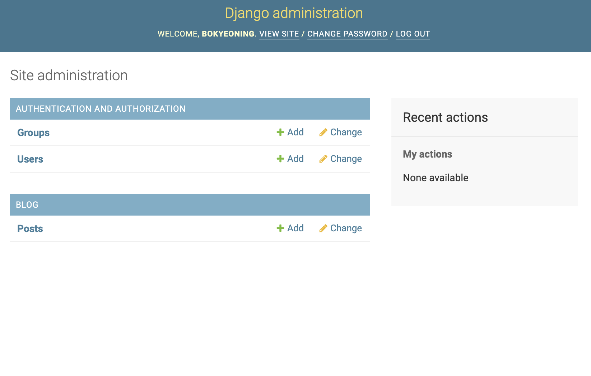

# Django 

## (1) Django 설치하기

1. python version 확인
```
python --version
```

2. python의 가상환경(Virtual Environment)을 간단하게 사용할 수 있는 virtualenv 모듈 설치
```
pip install virtualenv pylint autopep8
```

3. Django를 사용하기 위한 환경 셋팅
```
mkdir server
cd server
virtualenv venv
```
위의 코드를 실행했을 때 아래와 같은 글이 나오면 성공
**Installing setuptools, pip, wheel...
done.**

4. 가상환경 활성화
```
source venv/bin/activate
```

5. Django 설치
```
pip install django
```

5. +) 잘 설치되었는지 확인
```
django-admin --version
```

6. 설치된 개발환경 파일로 저장
```
pip freeze > requirements.txt
```

7. 설치가 완료되면 가상환경 종료
```
deactivate
```


## (2) Django 셋팅

1. 프로젝트 생성
```
django-admin startproject django_project
```

2. Django 구조 
(생성한 프로젝트는 django_project의 하위 파일)
    * settings.py : 전반적인 장고의 설정을 가지고 있는 파일
    * urls.py : 프로젝트의 url을 관리하는 파일
    * wsgi.py : 웹서버와 연동하기 위한 파일
    * manage.py : 프로젝트 관리 (DB의 migration 생성 및 실행, 로컬에서 웹서버 가동 등)

3. `settings.py` 파일 수정 (108, 114 line)
```
TIME_ZONE = 'Asia/Seoul'
USE_TZ = False
```

4. static 파일을 다루기 위해 `STATIC_ROOT` 파일 추가
```
STATIC_URL = '/static/'
STATIC_ROOT = os.path.join(BASE_DIR, 'static')
```

5. Django 테스트 웹서버 실행
```
python manage.py runserver
```

## (3) Django 어플리케이션 생성

1. 경로 (cd django_project인 상태에서)
```
python manage.py startapp blog
```

2. 어플리케이션 등록
- 장고 어플리케이션을 생성하였으니, 장고 프로젝트에 새로 생성한 어플리케이션을 등록해야한다.
- 장고 프로젝트를 관리하는 `django_project/settings.py`를 열고 어플리케이션 등록
```
INSTALLED_APPS = [
.
.
.
'blog'
]
```
제일 밑에 새로 만든 어플리케이션인 blog를 추가해준다.


## (4) 모델(Model) 생성
- `blog/models.py`를 열고 아래의 내용을 추가

```python
from django.db import models
from django.utils import timezone

class Post(models.Model):
    author = models.ForeignKey('auth.User', on_delete=models.CASCADE)
    title = models.CharField(max_length=100)
    content = models.TextField()
    created_at = models.DateTimeField(auto_now_add=True)
    updated_at = models.DateTimeField(auto_now=True)
    published_at = models.DateTimeField(blank = True, null = True)

    def publish(self):
        self.published_at = timezone.now()
        self.save()

    def __str__(self):
        return self.title
```
- 블로그를 목적으로 모델을 구성할 때 기본이 되는 코드 
- 기본적으로 Post는 블로그 게시글의 모델을 정의하는 클래스
    - author, title, content, created_at, updated_at,  published_at 필드를 가진다.
* Field types - 각각의 필드는 적절한 필드 클래스의 인스턴스여야 한다.
    - 필드 클래스는 아래의 몇 가지 사항을 정의합니다.
        1. 데이터베이스 컬럼의 데이터 형
        2. form field를 렌더링 할 때 사용할 기본 HTML 위젯
        3. Django admin에서 자동으로 만들어지는 form의 검증 형태
- publish :  현재 시간을 받아서 날짜를 갱신
- __str__ :  표준 파이썬 클래드 메소드 -- 문자열 반환
더 자세한 사항은 [Django Model field reference](https://docs.djangoproject.com/en/1.10/ref/models/fields/#model-field-types) 참고!

## (5)모델(Model)과 DB
1. 모델로부터 데이터베이스 테이블을 생성하기 위한 마이그레이션 파일 생성
```
python manage.py makemigrations blog

Migrations for 'blog' :
    blog/migrations/0001_initial.py
    - Create model Post**
```
- 위와 같은 글이 출력되면 정상적으로 생성된 것

2. 모델로부터 생성한 마이그레이션 파일을 이용하여 데이터베이스 테이블 생성
```
python manage.py migrate blog

Operations to perform:
    Apply all migrations: blog
    Running migrations:
    Applying contenttypes.0001_initial... OK
    Applying auth.0001_initial... OK
    Applying blog.0001_initial... OK**
```
- 위와 같은 글이 출력되면 정상적으로 테이블 생성된 것

## (6)슈퍼유저 등록
```
(venv)python manage.py createsuperuser
Username : 
Email address: 
Password: 
Password (again): 
```
절차에 맞게 입력. 
정상적으로 입력이 되면  **Superuser created successfully.** 문구가 출력된다.

## (7) 관리자 페이지 접속
```
python manage.py runserver
```
`http://127.0.0.1:8000/admin` 에 접속

- 슈퍼유저 등록시 지정했던 Username과 Password를 입력한다.


위와 같이 접속된 관리자 페이지를 볼 수 있다.

## (8) 관리자 페이지에 모델 등록
- 장고가 기본적으로 제공하는 관리자 페이지에서 우리가 만든 장고 어플리케이션 모델을 관리하기 위해서는 모델을 등록해야한다.
`blog/admin.py`을 열고 `Post`모델을 등록시킨다.
```python
from django.contrib import admin
from .models import Post

admin.site.register(Post)
```
새로고침 후 관리자 페이지를 확인하면 `blog/admin.py` 장고 어플리케이션의 모델이 화면에 표시된다. 

- **BLOG/Posts**에 옆에 있는 **+Add**를 눌러 글을 작성


- 성공적으로 글이 올라간 것을 확인할 수 있다.

## sqlite python parser
### python pandas를 활용하여 sqlite파일을 확인하고 다룰 수 있다.
* sqlite와 python을 parsing을 하면 DataFrame을 활용하여 데이터를 전처리할 수도 있고 csv로 저장 할 수 있다. :+1:

1. import 해주고 sqlite파일이 있는 경로를 찾아 connect
```python
import sqlite3
import pandas as pd
con = sqlite3.connect('db.sqlite3가 들어있는 절대경로를 적는다.')
```

2. SQL구문을 호출하려면 cursor 객체가 필요
```python
cursor = con.cursor() 
cursor.execute('SELECT * FROM blog_post')
```

3. 선택한 테이블로부터 로우 단위로 데이터를 읽으려면 fetchall 메서드 호출
```python
cursor.fetchall()


[(1,
'[SQL]관계형 데이터 베이스 특징',
'모든 데이터를 2차원 테이블로 표현\r\n테이블은 row(record, tuple)과 column(field, item)으로 이루어진 기본 데이터 저장 단위\r\n상호 관련성을 가진 테이블(table)의 집합\r\n만들거나 이용하기도 비교적 쉽고, 확장이 용이하다는 장점\r\nER모델에 따라, DB가 만들어지며, 데이터베이스는 하나 이상의 테이블로 구성 (ER모델에서 엔티티를 기반으로 테이블이 만들어짐)',
'2019-10-26 16:29:11.179508',
'2019-10-26 16:29:11.179532',
'2019-10-26 16:29:06',
1),
(2,
'[SQL]스키마',
'데이터베이스의 구조와 제약조건에 관해 전반적인 명세를 기술한 것\r\n1.개체의 특성을 나타내는 속성(attribute)\r\n2.속성들의 집합으로 이루어진 개체(entity)\r\n3.개체 사이에 존재하는 관계(relation)\r\n> 속성, 개체, 관계에 대한 정의와 이들이 유지해야 할 제약조건을 기술한 것',
'2019-10-26 16:29:39.420377',
'2019-10-26 16:29:39.420403',
'2019-10-26 16:29:38',
1)]

```

4. pandas read_sql함수를 사용, 쿼리문을 작성하여 데이터를 불러온다.
```python
blog_post = pd.read_sql('SELECT * FROM blog_post', con,index_col=None)
```
- blog_post를 입력하여 데이터베이스에 저장된 정보를 불러온다.


5. (이 부분은 개인적으로 보기 편하게 \r\n기준으로 잘라서 보려고 작성했다.)

